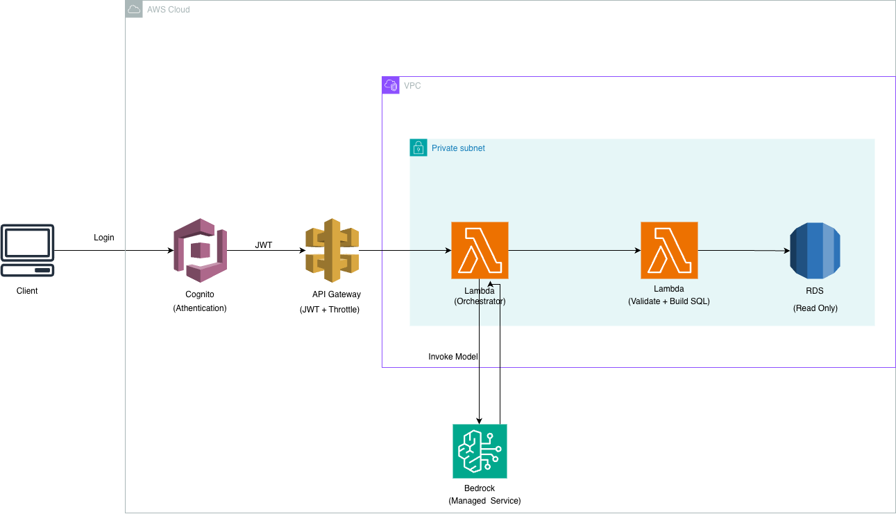

# WorldBank AI Query Platform

AI-powered natural language to SQL analytics platform built using AWS Lambda and Amazon Bedrock, with strict read-only SQL validation and secure serverless architecture.

---

## Overview

This project enables users to query World Bank data using natural language.  
The system converts user questions into validated SQL queries using Amazon Bedrock and executes them securely against a Microsoft SQL Server database.

The architecture enforces strict read-only controls to prevent destructive operations.

---

## Architecture



User → React Frontend → API Gateway → Lambda Orchestrator (Bedrock SQL Generator)  
                                                                                  ↓  
                                                                      Lambda SQL Executor  
                                                                                  ↓  
                                                              Microsoft SQL Server  

---

## Components

### Frontend
- Built with React + Vite
- Sends natural language questions to backend API

### Lambda Orchestrator
- Uses Amazon Bedrock (Claude model)
- Generates SQL from user question
- Enforces strict read-only validation
- Sanitizes model output
- Invokes SQL execution Lambda

### Lambda SQL Executor
- Executes validated SQL queries
- Enforces max row limits
- Prevents destructive statements

### Database Layer
- World Bank dataset stored in SQL Server
- Normalized schema with Countries and Observations tables

---

## Security Controls

- Strict SELECT / WITH only enforcement
- Regex blocklist for destructive SQL keywords
- Output sanitization from LLM
- Lambda-to-Lambda isolation
- Controlled CORS headers
- Maximum row limits to prevent abuse

---

## Example API Request

POST /query

```json
{
  "question": "Top 5 countries by GDP"
}
